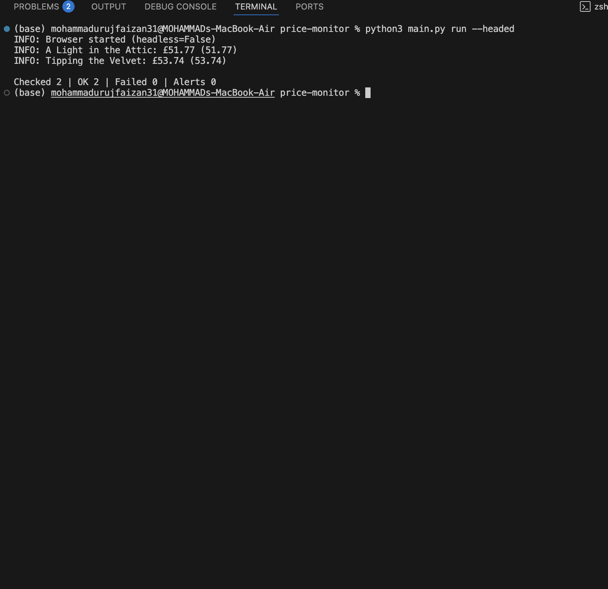
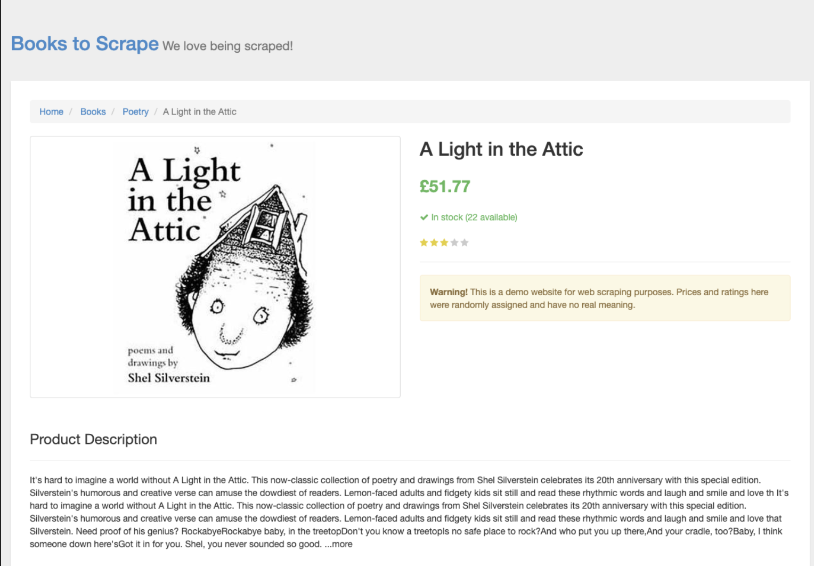
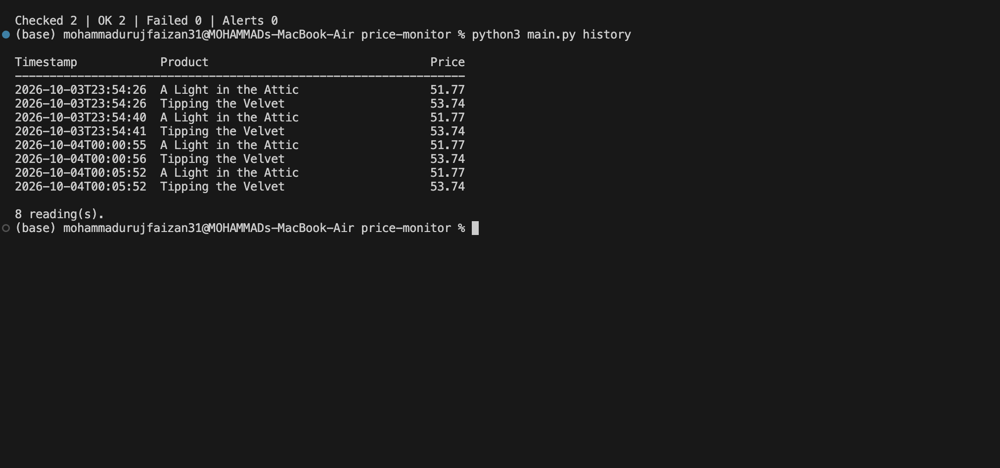

# Price Monitor

A command line price tracker built with **Python** and **Microsoft Playwright**. It opens product pages in a real browser, waits for the price to appear, reads it, saves a screenshot as evidence, records the result in a CSV history, and alerts you when a price drops or reaches your target.

## Features

- Browser automation with **Playwright** (Chromium), including proper waits for prices that load late
- Tracks any number of products, configured in `products.json` (URL, CSS selector, optional target price)
- **Price parsing** for common formats: `£51.77`, `$1,299.00`, `12,99 €`, `1.299,00 €`
- **Screenshots** of every successful check, plus an `error_` screenshot when a check fails
- **CSV price history** with a `history` command to view recent readings
- **Alerts** when a price drops or newly reaches your target, with optional **e-mail notifications**
- **Retries** with back-off for network errors and timeouts
- One failing product never stops the rest of the run
- **Headless** by default, `--headed` to watch the browser, `--watch` to check on a schedule
- Settings and secrets in `.env`, with no hardcoded credentials
- Logging to the console and to `logs/price_monitor.log`
- Unit tests plus integration tests that drive a real browser, and a GitHub Actions workflow

## Requirements

- Python 3.11+
- See `requirements.txt`

## Installation

```bash
git clone https://github.com/uruj04/price-monitor.git
cd price-monitor
pip install -r requirements.txt
playwright install chromium
cp .env.example .env
```

## Usage

Check every product once:

```bash
python main.py run
```

Watch the browser while it works:

```bash
python main.py run --headed
```

Keep checking every 10 minutes (press Ctrl+C to stop):

```bash
python main.py run --watch --interval 600
```

Show recorded prices:

```bash
python main.py history
python main.py history --name "A Light in the Attic" --limit 10
```

Exit codes: `0` success, `1` configuration error, `2` at least one product failed.

## Configuring products

Edit `products.json`. Each entry needs a `name`, `url` and `price_selector` (a CSS selector for the element showing the price). `target_price` is optional.

```json
[
  {
    "name": "A Light in the Attic",
    "url": "https://books.toscrape.com/catalogue/a-light-in-the-attic_1000/index.html",
    "price_selector": "div.product_main p.price_color",
    "target_price": 50.00
  }
]
```

The default products come from [books.toscrape.com](https://books.toscrape.com), a site built for scraping practice. Many real shops forbid automated access in their terms and actively block bots, so check a site's terms before pointing this tool at it.

To find a selector: open the product page, right-click the price, choose **Inspect**, and note the element's tag and class.

## Configuration (`.env`)

| Variable | Default | Purpose |
|---|---|---|
| `HEADLESS` | `true` | Run the browser without a window |
| `TIMEOUT_MS` | `15000` | Max wait for a page or price to appear |
| `MAX_RETRIES` | `3` | Attempts per product before giving up |
| `RETRY_DELAY_S` | `2` | Base delay between attempts (grows each attempt) |
| `PRODUCTS_FILE` | `products.json` | Products to monitor |
| `DATA_FILE` | `data/price_history.csv` | Price history |
| `SCREENSHOT_DIR` | `screenshots` | Where screenshots are saved |
| `LOG_FILE` | `logs/price_monitor.log` | Log file |
| `SMTP_HOST`, `SMTP_PORT`, `SMTP_USER`, `SMTP_PASSWORD`, `ALERT_EMAIL_TO` | empty | Optional e-mail alerts. All must be set to enable them |

`.env` is listed in `.gitignore`, so your credentials are never committed. For Gmail, use an [app password](https://support.google.com/accounts/answer/185833), not your normal password.

## Project structure

```
price-monitor/
├── main.py                       # Entry point
├── products.json                 # Products to track
├── .env.example                  # Settings template
├── pricemonitor/
│   ├── cli.py                    # Commands: run, history
│   ├── monitor.py                # One full pass over all products
│   ├── scraper.py                # Playwright automation
│   ├── parsing.py                # Price text -> number
│   ├── alerts.py                 # Alert rules and e-mail
│   ├── storage.py                # CSV history
│   ├── config.py                 # .env settings and products loader
│   ├── models.py                 # Product and PriceReading
│   ├── exceptions.py             # Custom exceptions
│   └── logger_config.py          # Logging setup
├── tests/                        # Unit and integration tests
├── screenshots/                  # Screenshots taken during runs
└── .github/workflows/tests.yml   # CI
```

## Architecture

**CLI** → **Monitor** → **Scraper** (browser) / **Storage** (CSV) / **Alerts**

- The scraper only knows how to load a page and read a price. It owns the browser and always closes it, even after an error.
- The monitor decides what to do with each result, and keeps going if one product fails.
- Storage, alerts and parsing are plain Python with no browser dependency, so they are tested in milliseconds.

## Error handling

- A product that cannot be loaded, or whose selector matches nothing, is retried, then reported as failed. The run continues.
- Text that contains no number raises `PriceParseError` and is not retried, because retrying cannot fix a wrong selector.
- Invalid `.env` values, a missing products file, or a malformed entry stop the run immediately with a clear message.
- E-mail failures are logged and never crash a run.
- Unexpected browser start-up failures explain how to install the browser.

## Running tests

```bash
python -m unittest discover -v
```

The integration tests start a small local web server and drive a real Chromium browser against test pages, including one where the price appears after a delay. If no browser can be started, they are skipped rather than failing. To use a specific Chromium binary, set `PW_CHROMIUM_PATH`.

## Screenshots

**Price check output**


**Captured product page**


**Price history**


## Author

**<Your Name>** — Python Internship, Algoryx
[LinkedIn](https://linkedin.com/in/mohd-uruj-a1207038a) · [GitHub](https://github.com/uruj04)
